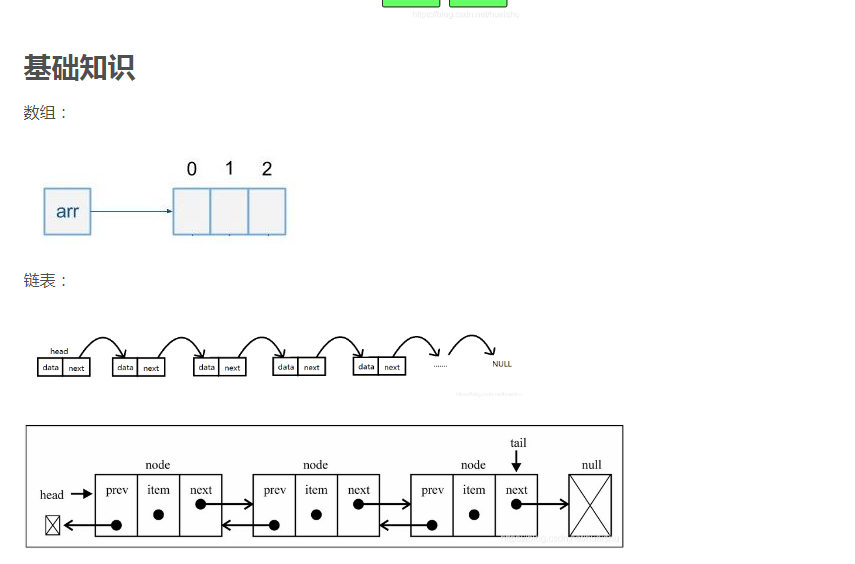
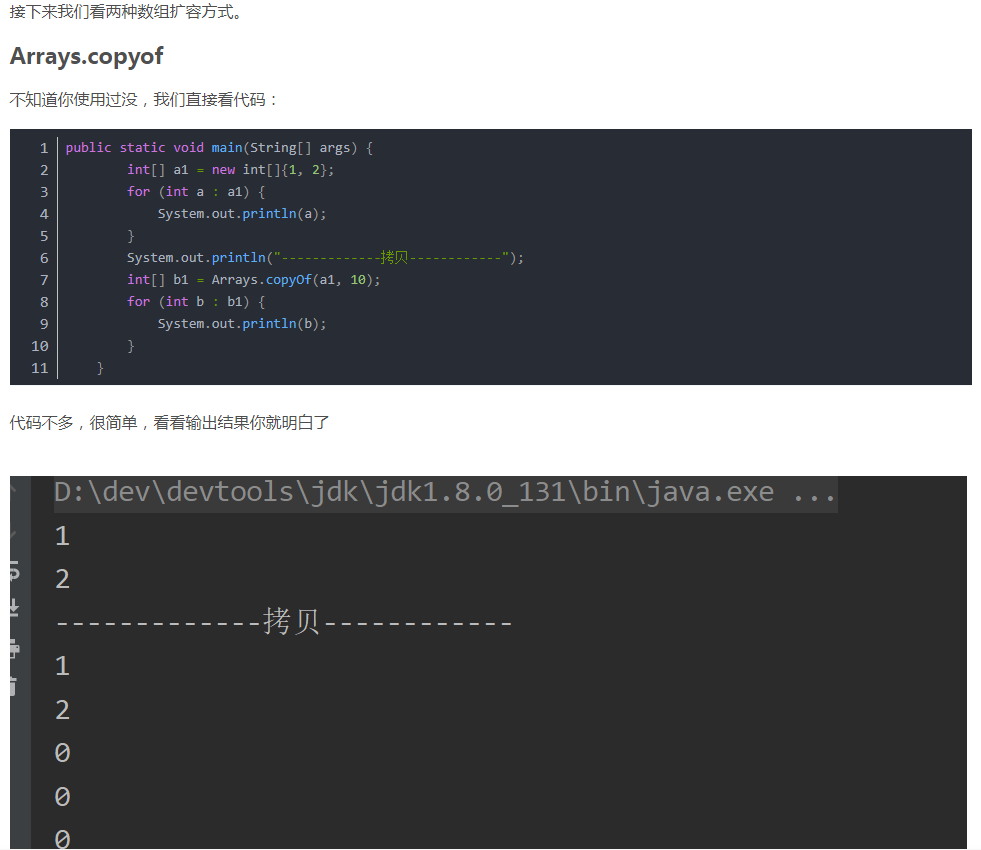
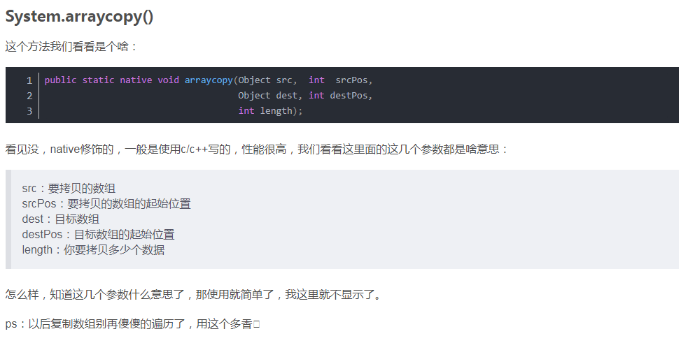

# ArrayList和LinkedList区别ArrayList和LinkedList的大致区别： 

1. ArrayList是实现了基于动态数组的数据结构，LinkedList基于链表的数据结构。 （LinkedList是双向链表，有next也有previous）
2. 对于随机访问get和set，ArrayList觉得优于LinkedList，因为LinkedList要移动指针。
3.  对于新增和删除操作add和remove，LinedList比较占优势，因为ArrayList要移动数据。 

数组的缺点

插入和删除效率低，必须移动数组
可能浪费内存
内存空间要求高，必须有足够的连续内存空间。
数组大小固定，不能动态拓展
链表的优点

插入删除速度快，只需通过指针指向对象地址
内存利用率高，不会浪费内存
大小没有固定，拓展很灵活
链表的缺点

不能随机查找，必须从第一个开始遍历，查找效率低

## 数组扩容技术

### Arrays.copyof

### System.arraycopy()

