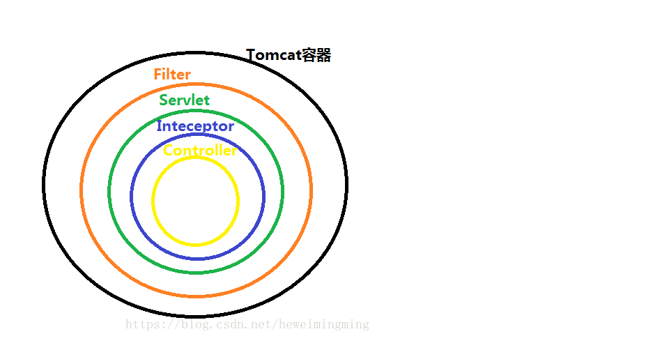
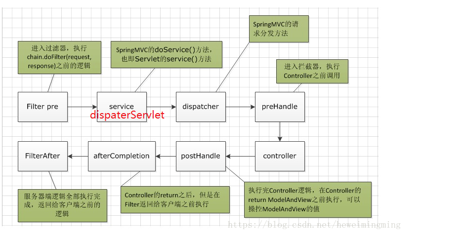

# spring boot 过滤器、拦截器的区别与使用

1、过滤器和拦截器触发时机不一样，过滤器是在请求进入容器后，但请求进入servlet之前进行预处理的。请求结束返回也是，是在servlet处理完后，返回给前端之前。



2、拦截器可以获取IOC容器中的各个bean，而过滤器就不行，因为拦截器是spring提供并管理的，spring的功能可以被拦截器使用，在拦截器里注入一个service，可以调用业务逻辑。而过滤器是JavaEE标准，只需依赖servlet api ，不需要依赖spring。



3、过滤器的实现基于回调函数。而拦截器（代理模式）的实现基于反射，代理分静态代理和动态代理，动态代理是拦截器的简单实现。

何时使用拦截器？何时使用过滤器？

- 如果是非spring项目，那么拦截器不能用，只能使用过滤器。
- 如果是处理controller前后，既可以使用拦截器也可以使用过滤器。
- 如果是处理dispaterServlet前后，只能使用过滤器。


# 过滤器使用

```java
/**
 * Created by Administrator on 2020/12/28.
 */
public class MyFilter implements Filter {

    @Override
    public void init(FilterConfig filterConfig) throws ServletException {

    }

    @Override
    public void doFilter(ServletRequest servletRequest, ServletResponse servletResponse, FilterChain filterChain) throws IOException, ServletException {
        // do something 处理request 或response
        System.out.println("filter1");
        // 调用filter链中的下一个filter
        filterChain.doFilter(servletRequest,servletResponse);
    }

    @Override
    public void destroy() {

    }
}
```

```java
/**
 * Created by Administrator on 2020/12/28.
 */
public class MyFilter2 implements Filter {

    @Override
    public void init(FilterConfig filterConfig) throws ServletException {

    }

    @Override
    public void doFilter(ServletRequest servletRequest, ServletResponse servletResponse, FilterChain filterChain) throws IOException, ServletException {
        // do something 处理request 或response
        System.out.println("filter2");
        // 调用filter链中的下一个filter
        filterChain.doFilter(servletRequest,servletResponse);
    }

    @Override
    public void destroy() {

    }
}
```


```java
/**
 * Created by Administrator on 2020/12/28.
 */
@Configuration
public class FilterConfig {
    @Bean
    public FilterRegistrationBean registrationBean() {
        FilterRegistrationBean filterRegistrationBean = new FilterRegistrationBean(new MyFilter());
        filterRegistrationBean.addUrlPatterns("/sh");
        filterRegistrationBean.setOrder(1);
        return filterRegistrationBean;
    }
    @Bean
    public FilterRegistrationBean ServletSecurityFilter() {
        FilterRegistrationBean filterRegistrationBean = new FilterRegistrationBean(new MyFilter2());
        filterRegistrationBean.addUrlPatterns("/demo");
        filterRegistrationBean.setOrder(2);
        return filterRegistrationBean;
    }
}
```

## Spring boot拦截器的使用：

```java

/**
 * Created by Administrator on 2020/12/28.
 */
public class MyInterceptor implements HandlerInterceptor {
    @Override
    public boolean preHandle(HttpServletRequest request, HttpServletResponse response, Object handler) throws Exception {
        System.out.println("preHandle");
        return true;
    }

    @Override
    public void postHandle(HttpServletRequest request, HttpServletResponse response, Object handler, @Nullable ModelAndView modelAndView) throws Exception {
        System.out.println("postHandle");
    }

    @Override
    public void afterCompletion(HttpServletRequest request, HttpServletResponse response, Object handler, @Nullable Exception ex) throws Exception {
        System.out.println("afterCompletion");
    }
}
```


```java

/**
 * Created by Administrator on 2020/12/28.
 */
@Configuration
public class InterceptorConfig extends WebMvcConfigurerAdapter {
    @Override
    public void addInterceptors(InterceptorRegistry registry) {
        registry.addInterceptor(new MyInterceptor());
    }
}
```

